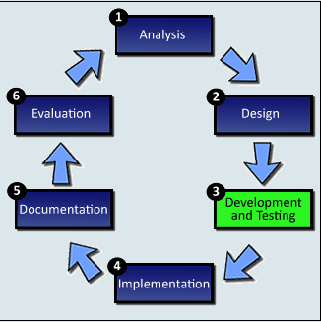
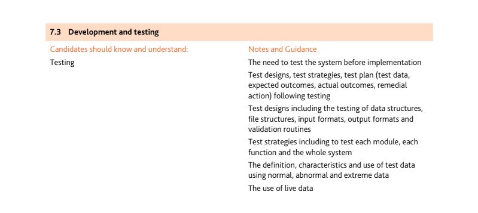
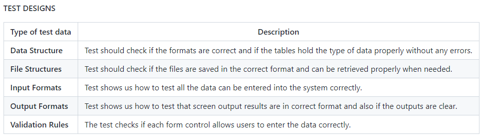
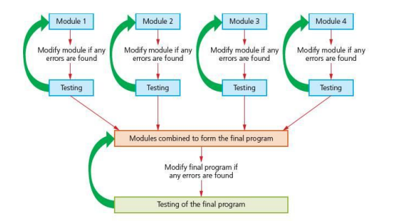
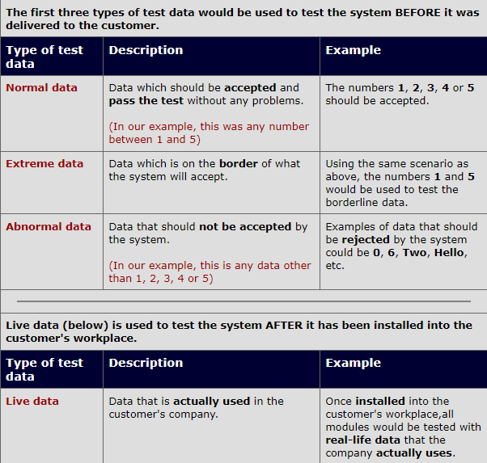
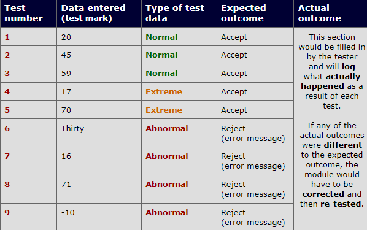

> “The computer was born to solve problems that did not exist before” -Bill Gates

---

# ***Development And Testing***

## **Syllabus**

---
## **What is *Development*?**

*Development* is the immediate process after the process *Design*. In the *development* stage is when developing the new system you will need to create. In other words, *development* just means to 'build the system'.

---
## **What is *Testing*?**

When each *module* of the system has been created, it must be tested to make sure that it works correctly.

Example of modules that should be tested include:

- **Data Structures** 
- **Validation Rules** 
- **Input and Output Screens**

---
## **Test Designs**

Test designs cover how a system is to be tested. The below table shows the test designs that need to be ensured and checked properly.

 
 
 ---
 ##  **Test Strategies**

 
 

 ---
 ##  **Testing with normal, extreme, abnormal, and live data**

 Scenario:
    
`Imagine we were testing a system module (text box) to make sure that it will only accept entries of numbers between 1 and 5. The test data would look like the example in the table below`

---
## **Test Plan Example**

The below table demonstrates an example test plan that could be used to test a **system module** that will be used to accept the age of a driving test candidate. The cell should accept ages within the range of **17 to 70**. Other data will be rejected.

## **Testing the whole system**

Once all the individual modules have been tested and put together as a single module, another test is conducted to check the system as a whole. Testing the whole system is known as ***Integration Testing***.

> Integration testing (sometimes called integration and testing, abbreviated I&T) is the phase in software testing in which individual software modules are combined and tested as a group. Integration testing is conducted to evaluate the compliance of a system or component with specified functional requirements.

This test is done to ensure that all the modules work with each other correctly and it also helps to identify problems, if any, in the system. The problems will then be corrected and the test on the whole system will be run again to ensure that there are no more possible errors and bugs.

