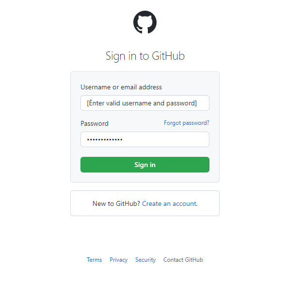
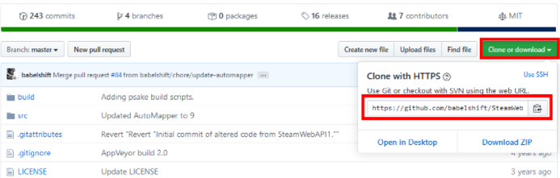

> This page is where you can learn all the magic that happens in developing AI and so on,...

# **How to host a website on github?**

STEP 1: Open [github.com](https://github.com/) and sign in or sign up with valid credentials. You'll most often see this landing page as shown in the image below. Your options to sign in or sign up will be available on the top right if your screen.

---




---
STEP 2: Download either [GitHub for Mac](https://desktop.github.com/) or [GitHub for Windows](https://desktop.github.com/), depending on your operating system. Open the app and log in using the account you just created.

---


---
STEP 3: (On Mac) - After you login, click advanced and make sure that your name and email are correct. Then, click "Install Command Line Tools", just in case you want to start using the command line later in life. Git is actually a command line tool, but GitHub's applications take its functionality and present it in an attractive interface.

---
.png)

---
STEP 4: Create a new repository in your GitHub application. Name it your-username.github.io. The name is very important. Note the folder that GitHub is saving the repository to. Make sure the "Push to GitHub?" box is checked.

STEP 5: Move your website's files into the folder that GitHub just created when you made the repository. IMPORTANT: Your homepage HTML file must be called "index.html", and it must exist in the top-level directory.

STEP 6: Back in the GitHub application, you should see your files in the left column. Make sure they are all checked. If so, enter a message in the text box called "commit summary", something like "initial commit." Then, click the commit button.

STEP 7: Click the "Publish repo" button in the top right corner.

STEP 8: Give it about 10 minutes, then check your-username.github.io. Your website should be there!

---
# **Using custom domain names**

You can just leave your website at that address (it'll give you some serious street cred in the developer world), but if you have a custom domain you would like to use, it is very simple to make GitHub redirect your page.

1. Log in to your domain registrar and find where to change your host records. If you don't know, you can usually Google "(domain registrar) change host records", and your registrar will have an explainer telling you how to do it.
2. Change your domain's A Record to 204.232.175.78. This is GitHub's IP address, which allows GitHub to resolve your URL and serve the correct files.
3. In your website's directory folder on your computer, create a file called "CNAME". On the first line, type your domain name. Save the file.
4. In your GitHub application, you should see the file in the left column. Make sure it is checked and enter your commit message. Have it say something like "Adding CNAME file."
5. Click "Sync branches."

It can take as long as 48 hours for your domain to resolve to your GitHub page. However, it is usually pretty quick, so check back in an hour or so.

---
# **Push existing local repository to remote**

But what if you already have a local repository? How do you get that into GitHub?

If some of your projects already have local repositories setup on your developer machine, then you will need to add the [new GitHub repositories as remotes](https://docs.github.com/en/get-started/getting-started-with-git/managing-remote-repositories). Just like when cloning a new repository, look for the remote URL in the upper right of your repository’s file viewer.



Now add the remote repository and name it “origin”. It doesn’t have to be named that, but it’s standard and matches what you would get if you used the git clone approach.

```bash
$ git remote add origin <URL to GitHub repo>
```

Confirm the remote was added properly

```bash
$ git remote -v
> origin <URL to GitHub repo> (fetch)
> origin <URL to GitHub repo> (push)
```

To push any commits that you have locally, use the following commands making note of the name of the remote repository to push against and the branch in which you want your changes included. If asked for credentials, you’ll need to use your GitHub username / email and password.

```bash
$ git push [remote] [branch]

# Example pushing the master branch to the origin remote
$ git push origin master
```

---
# **User Site vs Project Site**

Everyone gets a single user GitHub Page which is published from a repository that is dedicated to that page. This page is typically used to showcase you, your abilities, and a collection of your projects. Treat this like a landing page dedicated to you. You can brag about yourself and your credentials or just make a good-looking listing of all your repositories and their GitHub Page.

Project sites are infinite and only limited by the number of repositories attached to your GitHub account. Use these to spruce up the public persona of your project to attract even more attention. Sure, a README file is good, but it’s usually just text. With a GitHub Page, you can build a full-blown web-based experience to show off your project and its use cases.

To build your user site, you’ll need to create a repository named `<username>.github.io` so that GitHub knows this repository exists only to be published for your user GitHub Page. You would then access this page at `https://<username>.github.io` unless you’re using a custom domain.

---
# **Build a basic calculator using python**

In this article, you will learn how to make a simple calculator that can do all of the four basic arithmatic operations (addition, subtraction, multiplication, division) based on the users need and input.

## Input:
```python
# Program make a simple calculator

# This function adds two numbers
def add(x, y):
    return x + y

# This function subtracts two numbers
def subtract(x, y):
    return x - y

# This function multiplies two numbers
def multiply(x, y):
    return x * y

# This function divides two numbers
def divide(x, y):
    return x / y


print("Select operation.")
print("1. Add")
print("2. Subtract")
print("3. Multiply")
print("4. Divide")

while True:
    # take input from the user
    choice = input("Enter choice(1/2/3/4): ")

    # check if choice is one of the four options
    if choice in ('1', '2', '3', '4'):
        num1 = float(input("Enter first number: "))
        num2 = float(input("Enter second number: "))

        if choice == '1':
            print(num1, "+", num2, "=", add(num1, num2))

        elif choice == '2':
            print(num1, "-", num2, "=", subtract(num1, num2))

        elif choice == '3':
            print(num1, "*", num2, "=", multiply(num1, num2))

        elif choice == '4':
            print(num1, "/", num2, "=", divide(num1, num2))
        
        # check if user wants another calculation
        # break the while loop if answer is no
        next_calculation = input("Want to do another math problem? (yes/no): ")
        if next_calculation == "no":
          break
    
    else:
        print("Invalid Input")
```

## Output:
```
Select operation.
1. Add
2. Subtract
3. Multiply
4. Divide
Enter choice(1/2/3/4): 4
Enter first number: 30
Enter second number: 3
30.0 * 3.0 = 10.0
Let's do next calculation? (yes/no): no
```

In this simple python program, we ask the user to choose an arithmatic operation which are one of the option 1, 2, 3, or 4. These four options are valid and if any other input is given by the user, `Invalid Input` will be displayed and the loop runs again until a valid input is given by the user.